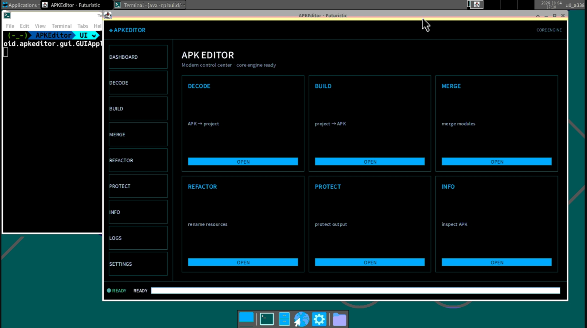
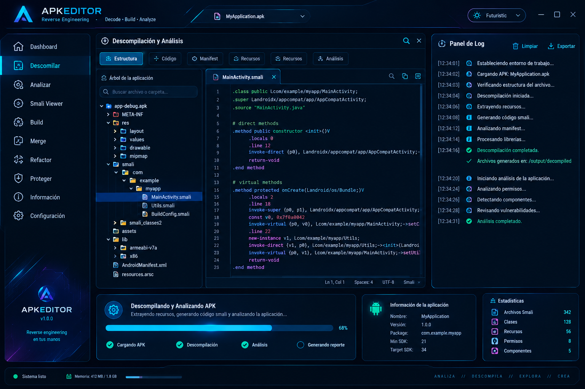

 

<p align="center">
  <b>⭐ APKEditor Futuristic interfaz ⭐</b>
</p>

## 📖 Descripción

APKEditor Futuristic es una interfaz gráfica moderna  que envuelve el motor original de APKEditor.


## Objetivo final 

 

> [!WARNING]
> Aunque exista la IA y sea buena jenerando codigo esto lo estoy haciendo para mejorar mis avilidades como programador y fortaleser mi conocimiento. (Solo un reto mas xD)

> [!NOTE]
> Todo lo tratare de documentar. Como todas mis ideas y esto estara en  `/docs/`

**Revisa siempre de primero**

- [apkeditor-ui](https://github.com/VictorH028/APKEditor/blob/UI/docs/apkeditor-ui.md) 

## Compilasion 

```bash
gradle  fatJar
```

## 🖥️ Iniciar la interfaz gráfica

Opción 1 – Desde el JAR empaquetado:

```bash
java -cp APKEditor-1.4.9-all.jar com.reandroid.apkeditor.gui.GUIApplication
```


